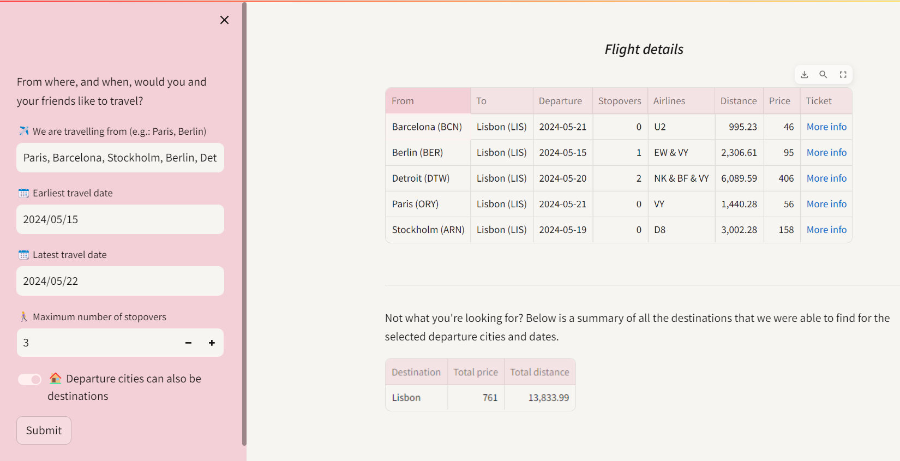

# Fly Me To the Mean1
1 "mean" as in "average", it's a working title... 🙂
## Multi-origin destination and flight search

The possibility to travel, work remotely, and develop meaningful connections with people all over the world, creates new challenges for whoever tries to organize a meetup of friends or colleagues in the physical world. Where should you meet? How can you make it as easy and economically feasible for everyone of you to get there?

This is where Fly Me To the Mean comes in. Given a set of departure cities and a date range, this service helps you find the destination with the cheapest *total* ticket price, or the cheapest average price per flight/person.

The service is built using free versions of the Kiwi Tequila API for flights ✈️, and the Carbon Interface estimates API for CO2 emission estimates 🍃. The web interface is built using Streamlit.

## Some next steps
- Make CO2 emission estimate, as well as price, a possible selection criterium 🍃
- Include departure cities as (optional) possible destinations 🍃
- Add support for multiple passngers per departure
- Add support for non-direct flights
- Add support for roundtrips